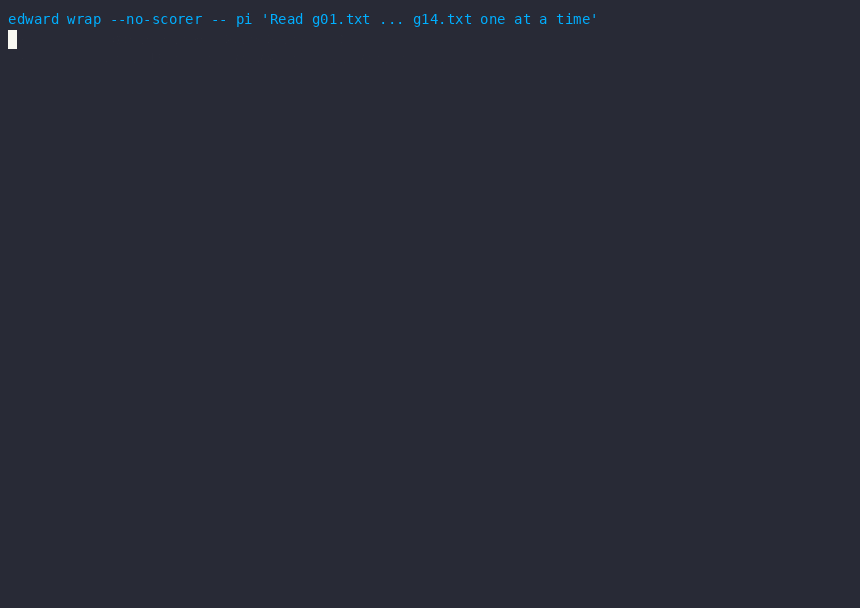
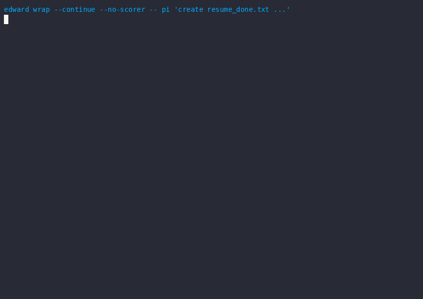

<div align="center">

# Edward

**An external control plane for AI coding agents — deterministic guardrails, a local semantic scorer, and interventions you can resume.**

[](https://github.com/VeridicalTech/Edward/actions/workflows/ci.yml)
[](https://pypi.org/project/edward-guard/)
[](https://pypi.org/project/edward-guard/)
[](https://pypi.org/project/edward-guard/)
[](LICENSE)
[](#why-zero-dependencies)
[](BENCHMARK.md)
[](CONTRIBUTING.md)

[PyPI](https://pypi.org/project/edward-guard/) · [Benchmark](BENCHMARK.md) · [Contributing](CONTRIBUTING.md) · [Changelog](CHANGELOG.md)

*Agents fail quietly. Edward notices.*

</div>

<div align="center">

<br><em>Live run: a looping agent is stopped mid-flight — decision signed, audited, resumable.</em>
</div>

---

Agents fail quietly. They retry the same broken test 40 times, burn $8 in tokens on a loop, run `rm -rf` on a database directory, and write to files they were never supposed to touch. The agent doesn't know it's failing — from its perspective, it's still trying.

Edward sits **between the agent and its runtime**. It watches the event stream, builds a picture of what the agent is actually doing across turns, and intervenes when the picture stops looking right.

```
Agent (Pi / Codex / custom)
    │ events
    ▼
Canonical Event Schema   ← normalizes tool names to capabilities
    │
    ▼
State Engine             ← materializes cross-turn agent state
    │
    ▼
Trigger Rules [FROZEN]   ← deterministic safety + convergence checks
    │
    ├─ HARD_CONSTRAINT ──→ Edward: BLOCK (scorer cannot override)
    │
    └─ SOFT_DECISION ──→ Local scorer ──→ Policy Resolver
                              │                │
                              └────────────────┘
                                       │
                                       ▼
                                 Control Kernel
                                       │
                                       ▼
                              PAUSE / CANCEL / RESUME
```

## Why not just if/else?

A watchdog (`error_count > 5 → stop`) looks at individual events. The failure modes that actually kill long-running agents don't show up in any single event — they emerge from the **shape of the trajectory over time**. We tested this directly on held-out data (seed 137, frozen config):

| Scenario | Watchdog | Edward (State Engine) | Watchdog ctx | Edward ctx |
|---|---|---|---|---|
| budget bleed | 20% | **100%** | 2,322 | 409 |
| infinite loop | 0% | **100%** | 6,084 | 409 |
| convergence stall | 0% | **100%** | 1,442 | 409 |
| dangerous command | 75% | **100%** | 522 | 434 |

Watchdogs miss temporal failure modes entirely because they have no memory across turns. Edward maintains a sliding window of tool calls, tracks file modifications, and computes elapsed time — none of which fit in a single-event check.

## Measured, not claimed

Edward validates itself against **[StepShield](https://github.com/glo26/stepshield)** (NeurIPS 2026), the first benchmark treating *intervention timing* as a first-class metric (9,429 trajectories, step-level labels, 216 held-out):

| Detector | Recall | FPR (clean) | EIR₃ (timing) | Cost / decision |
|---|---|---|---|---|
| LLMJudge (GPT-4.1-mini, paper) | **95.4%** | 5.6% | 0.89 | GPT-4.1-mini price |
| **Edward contract probe (Jev 1.13)** | 59.3% | **10.2%** | **0.91** | ~$0.0001, one batched call |
| **Edward contract probe (local 4B)** | 58.3% | 17.6% | **0.78** | **~$0.00002, on your GPU** |
| **Edward rules only** | 7.4% | — | — | 0 |
| HybridGuard (paper) | 75.9% | 44.4% | 0.40 | — |
| StaticGuard 847 rules (paper) | 86.1% | 77.8% | 0.23 | — |

The deterministic layer alone is quantitatively blind to content-semantic violations (7.4%) — the "silent corruption" gap — while keeping the best false-positive rate. Swapping the judgment backend changes the trade, not the architecture: the **local 4B** keeps events on your network at zero marginal cost; **TypeSafe Jev** lifts EIR₃ above the paper's GPT-4.1-mini judge (0.91 vs 0.89) with 42% fewer false positives, one batched calibrated call per probe battery. Trajectory-level recall is the shared frontier for small judges — we measure and publish it rather than claim it away. Full series, raw logs, reproduction commands: [BENCHMARK.md](BENCHMARK.md).

## What it detects

Eight trigger rules, tuned on a dev split (seed 42) and frozen for held-out evaluation (seed 137):

| Signal | Fires when |
|---|---|
| Error rate | > 40% over the last 8+ calls, no recovery signal |
| Retry count | ≥ 3 retries of the same thing |
| Token budget | > 80% consumed |
| Convergence stall | > 600s + > 5 turns, no completion |
| Passive stall | 12 consecutive reads, 0 writes |
| Dangerous command | `rm -rf`, `sudo`, `git push --force`, `curl | sh`, … |
| Scope violation | writes outside the allowed path prefixes |
| Silent corruption risk | ≥ 10 consecutive file writes with zero shell verification |

Policy packs make the knobs yours: `conservative` / `balanced` (= FROZEN defaults) / `aggressive`, as TOML or JSON.

## Quickstart

```bash
pipx install edward-guard            # zero dependencies, Python 3.11+

edward doctor                        # environment checks
edward demo                          # self-running proof: 6 failure scenarios, PASS/FAIL
edward demo --live-scorer --offline  # same proof through the full scorer pipeline (heuristic stub, no GPU)

edward wrap -- pi "fix the flaky test"                     # full monitoring + intervention
edward wrap --no-scorer -- python my_agent.py              # any command, rule-only
edward wrap --scope ./src --auto-resume 60 -- pi "task"    # scoped writes, auto-resume
```

```console
$ edward demo
policy: balanced  trials/scenario: 3

scenario             expect     result        latency
-----------------------------------------------------
normal               no-fire    clean               —  ok
transient_failure    no-fire    clean               —  ok
infinite_loop        fire       100% detected      8.0  ok
budget_bleed         fire       100% detected     12.0  ok
dangerous            fire       100% detected      4.7  ok
stall                fire       100% detected      4.0  ok

PASS in 0.0s (deterministic rules frozen defaults; scorer off)
```

Real output, not a mock — six failure scenarios against the frozen rule set,
plus the two clean controls. Wraps **any subprocess**: Pi, Codex, `claude -p`,
CI jobs, plain scripts. `--agent auto|generic|pi` picks the adapter (pi gets
native RPC; the registry is extensible via `edward.adapters` entry points).

Interventions are **resumable, not fatal**: PAUSE exits with code 75, pins the
agent session, and `edward wrap --continue` picks the same session back up
from the audit log. CANCEL / BLOCK exit 76. Audit lands in
`~/.edward/audit.jsonl` — including an estimated avoided-spend per intervention.

**The scorer is optional and always advisory.** Point `EDWARD_SCORER_URL` at
any local OpenAI-compatible scoring endpoint (a 4B model on your GPU box is
plenty — see [deploy/](deploy/) for the team-LAN topology). Scorer down?
Edward logs a warning and runs rule-only. It stays protective.

**Pluggable scorer backends.** `EDWARD_SCORER_BACKEND` selects where judgments
come from: `endpoint` (default — the LAN scorer server above), `jev` (TypeSafe
Jev — all probes batched into one calibrated call; set `TYPESAFE_API_KEY`), or
`heuristic` (deterministic marker stub for offline demos and tests). `edward
doctor` shows the active backend. All backends are advisory and share the same
circuit breaker.

**Edward + Jev — who decides what.** With the `jev` backend
([`edward/backends.py`](edward/backends.py)), one Jev call receives the full
cross-turn state (error trends, write streaks, budget) and returns calibrated
judgments — *should this trajectory continue, pause, or escalate, and how
confident is that?* Deterministic code owns everything irreversible: blocklists,
scope checks, budget caps, intervention execution, and the signed receipt chain.
Jev's confidence gates routing, never actions. Known limitation: the local-4B
and Jev paths trade recall differently (see [BENCHMARK.md](BENCHMARK.md) for
measured numbers and reproduction commands).

**v0.3.0 highlights**

- **Pluggable scorer backends** — `EDWARD_SCORER_BACKEND` selects `endpoint`
  (your LAN 4B), `jev` (TypeSafe Jev: all probes in one batched calibrated
  call), or `heuristic`. `edward demo --live-scorer --offline` runs the full
  rules+scorer pipeline with **no GPU and no API key**.
- **Agent adapter registry** — `--agent auto|generic|pi|<plugin>`; third-party
  adapters join via the `edward.adapters` entry-point group.
- **Process-tree interventions** — pause/kill terminate the whole agent
  subtree (POSIX process groups, Windows CTRL_BREAK + taskkill /T) — no more
  orphaned npm/python children.
- **v0.2.0** added signed evidence receipts (Ed25519 hash chain, offline
  `edward verify`) and the human approval loop (`--wait-approval 300`).

<div align="center">

</div>

## Why zero dependencies?

Edward's control loop runs stdlib-only: it must boot on any Python 3.11+
box, inside any container, in front of any agent — including air-gapped
ones. The heavy lifting (scoring) is delegated to a *separate* local
service, which you own and can swap (4B quantized, bigger, whatever) without
touching the control plane.

## Repository map

```
edward/                the package
  cli.py               wrap / demo / eval / audit / doctor
  engine.py            ControlPlane: events → triggers → scorer → decision → audit
  state_engine.py      cross-turn agent state
  triggers.py          8 rules, policy-parameterized (defaults FROZEN)
  scorer_client.py     /v1/score client + circuit breaker
  stepshield.py        external benchmark adapter (EIR metrics)
  scenarios.py         failure scenario suite (demo/eval source of truth)
benchmark.py           300-trial held-out benchmark
robustness_eval.py     4-dimension robustness attack
BENCHMARK.md           full measurement series + reproduction commands
deploy/                team-LAN deployment templates
```

## Status & roadmap

- [x] v0.3.0 on PyPI: scorer backends (endpoint / Jev / heuristic), agent adapter registry, process-tree hardening
- [x] StepShield integration with paper-aligned EIR metrics — including the **Jev 1.13 backend row (EIR₃ 0.906)**
- [x] Scorer fine-tune — attempted and abandoned under a pre-registered two-strike protocol (post-mortem in BENCHMARK.md)
- [ ] Robustness suite as `edward eval --suite robustness`
- [ ] Cloud fleet console (team tier)

## Contributing

Deterministic layer stays deterministic: trigger defaults are FROZEN, and
behavior-affecting changes require re-running the benchmark gate. See
[CONTRIBUTING.md](CONTRIBUTING.md).

## License

[MIT](LICENSE) — © 2026 Edward contributors
