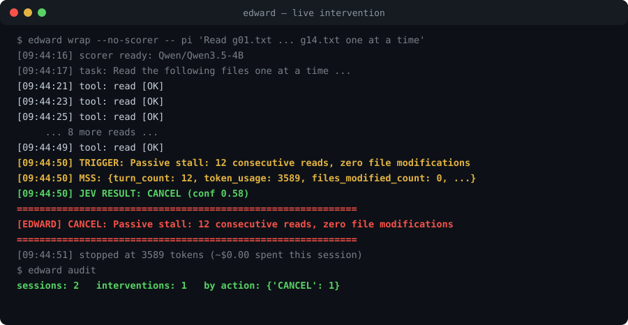

<div align="center">

# Edward

**AI 编码代理的外部控制平面 —— 确定性护栏 + 本地语义打分器 + 可恢复的人工干预。**

[](https://github.com/VeridicalTech/Edward/actions/workflows/ci.yml)
[](https://pypi.org/project/edward-guard/)
[](pyproject.toml)
[](LICENSE)
[](#为什么零依赖)

*Agents fail quietly. Edward notices. —— 代理悄然失控时，Edward 察觉。*

</div>

<div align="center">

<br><em>真实运行：循环中的代理被中途叫停——决策已签名、已审计、可恢复。</em>
</div>

---

代理会悄无声息地失败：同一个坏测试重试 40 次、一晚上烧掉几十美元的 token、对数据库目录执行 `rm -rf`、改写不该碰的文件。代理自己并不知道失败——在它看来，一切仍在"努力尝试"。

Edward 坐在**代理与其运行时之间**：观测事件流、跨回合构建代理真实状态图景、在图景不对劲时出手干预。



## 不是又一个 if/else

看门狗式检查（`错误数 > 5 → 停`）只看单个事件。真正杀死长任务的失败模式——死循环、假性收敛、预算失血——都藏在**轨迹的形状**里。冻结配置下的 held-out 实测（seed 137）：

| 场景 | 看门狗 | Edward | 看门狗上下文 | Edward 上下文 |
|---|---|---|---|---|
| 预算失血 | 20% | **100%** | 2,322 | 409 |
| 死循环 | 0% | **100%** | 6,084 | 409 |
| 收敛停滞 | 0% | **100%** | 1,442 | 409 |
| 危险命令 | 75% | **100%** | 522 | 434 |

## 用数据说话

Edward 以 **[StepShield](https://github.com/glo26/stepshield)**（NeurIPS 2026，首个把*干预时机*作为一级指标的基准，216 条 held-out 轨迹）自我验证：

| 检测器 | Recall | FPR（正常轨迹） | EIR₃（干预时机） | 单次成本 |
|---|---|---|---|---|
| LLMJudge（GPT-4.1-mini，论文） | **95.4%** | 5.6% | 0.89 | GPT-4.1-mini 价格 |
| HybridGuard（论文） | 75.9% | 44.4% | 0.40 | — |
| **Edward 契约探针（本地 4B）** | 58.3% | **17.6%** | **0.78** | **~$0.00002** |
| Edward 仅规则层 | 7.4% | **1.9%** | — | 0 |
| StaticGuard 847 规则（论文） | 86.1% | 77.8% | 0.23 | — |

确定性规则层对内容语义违规天然失明（7.4%）——"沉默腐化"缺口；叠加**本地 4B 打分器 + 证据注入 + 非对称时序确认**后，干预时机进入 GPT-4.1-mini 判官档位，边际成本趋零。完整测量系列与复现命令见 [BENCHMARK.md](BENCHMARK.md)。

## 八条触发规则

错误率 / 重试计数 / token 预算 / 收敛停滞 / 被动打转 / 危险命令 / 越权写入 / 未验证连续写。策略包三种预设：`conservative` / `balanced`（= FROZEN 默认）/ `aggressive`，TOML 或 JSON。

## 30 秒上手

```bash
pipx install edward-guard            # 零依赖，Python 3.11+

edward doctor                        # 环境体检
edward demo                          # 自跑演示：6 个失败场景，PASS/FAIL

edward wrap -- pi "fix the flaky test"                     # 全功能监控+干预
edward wrap --no-scorer -- python my_agent.py              # 任意命令，纯规则
edward wrap --scope ./src --auto-resume 60 -- pi "task"    # 限定写入范围，自动续跑
```

**干预可恢复，不是死刑**：PAUSE 以 exit 75 退出并钉定会话，`edward wrap --continue` 从审计日志找回同一会话续跑；`--wait-approval` 会把 Resume/Kill 决策链接推到 Slack。CANCEL/BLOCK 以 76 退出。审计落在 `~/.edward/audit.jsonl`，逐条 Ed25519 签名成链——`edward verify` 离线验篡改。

**打分器可选且永远只是建议**。`EDWARD_SCORER_URL` 指向任意本地 OpenAI 兼容端点（GPU 盒子上的 4B 足够，见 [deploy/](deploy/)）；打分器宕机自动回落纯规则，保护不缺席。

**v0.2.0 亮点**

- **签名证据链**：每条审计记录 Ed25519 签名成哈希链（纯 stdlib，RFC 8032 向量验证）；`edward verify` 离线验篡改——公布你的公钥，任何人可验
- **人工审批环**：`--wait-approval 300` 把 Resume/Kill 链接推到 Slack（或 stderr）并等待；PAUSE 变成一个决策点，而不是死路

<div align="center">

</div>

## 为什么零依赖？

控制循环纯 stdlib：任何 3.11+ 的机器、任何容器、任何代理（含离线内网）即起。重活（语义打分）委派给**你自有的独立本地服务**——可换可升级，控制面不动。

## 仓库地图

```
edward/                包本体
  cli.py               wrap / demo / eval / audit / doctor / keygen / verify
  engine.py            ControlPlane：事件 → 触发 → 打分 → 决策 → 审计
  state_engine.py      跨回合代理状态
  triggers.py          8 条规则，策略参数化（默认 FROZEN）
  receipts.py          Ed25519 签名证据链（纯 stdlib，RFC 8032 向量验证）
  stepshield.py        外部基准适配器（EIR 指标）
BENCHMARK.md           完整测量系列 + 复现命令
deploy/                团队内网部署模板
```

## 状态与路线

- [x] v0.1.1 上架 PyPI，三平台 CI
- [x] StepShield 集成（EIR 时机口径）
- [x] 签名证据链 + Slack 审批（v0.2.0）
- [ ] `edward eval --suite robustness` 鲁棒性套件
- [ ] 打分器微调（数据飞轮来自审计日志）
- [ ] 云 fleet 控制台（团队档）

## 参与贡献

确定性层保持确定性：触发默认值 FROZEN，行为变更必须重跑基准门。见 [CONTRIBUTING.md](CONTRIBUTING.md)。

## 许可

[MIT](LICENSE) — © 2026 Edward contributors
